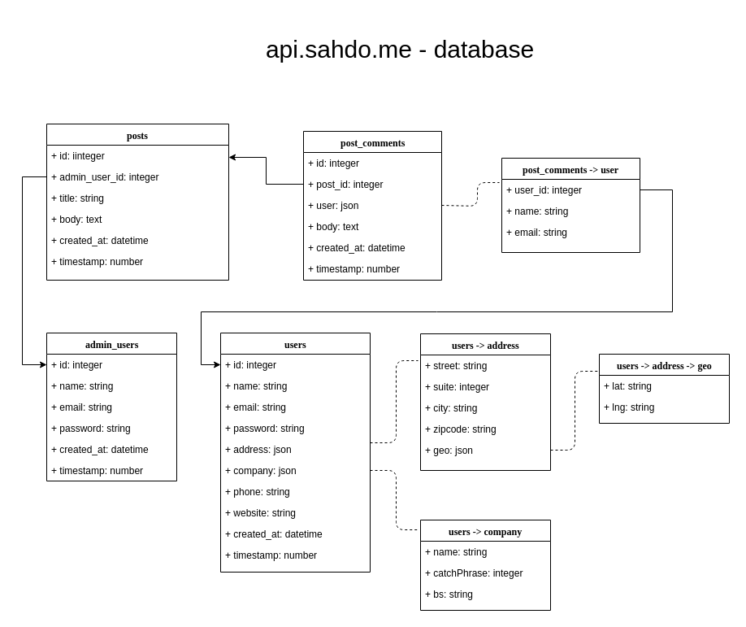

# api.sahdo.me

api.sahdo.me é uma api rest desenvolvida em PHP com o microframework Lumen 5.6.4. Ele é responsável por todo o backend do website sahdo.me.
Para testar a aplicação acesse [sahdo.me](http://sahdo.me) 

## Setup

Para simular o projeto em ambiente local você vai precisar configurar um servidor nginx ou apache. Não entrarei em muitos detahes, mas fornecerei o setup que utilizei com nginx.

O primiero passo é baixar o projeto e executar o seguinte comando:

    composer update
        
Esse comando irá instalar todas a dependências do composer na pasta vendor do Lumen.

Feito isso você irá precisar criar um arquivo de configuração .env na raiz do projeto.
    
Crie o arquivo .env e cole a seguinte configuração:

    APP_ENV=local
    APP_DEBUG=true
    APP_KEY=
    APP_TIMEZONE=UTC
    
    LOG_CHANNEL=stack
    LOG_SLACK_WEBHOOK_URL=
    
    DB_CONNECTION=mongodb
    DB_HOST=mongodb://165.227.190.249:27777
    DB_PORT=3306
    DB_DATABASE=sahdo_me
    
Vamos precisar alterar algumas permissões, primeiramente digite:
    
    sudo chgrp -R www-data storage

Em seguida:

    sudo chmod -R ug+rwx storage
                  
Agora, conforme disse anteriormente mostrarei como configurei o virtualhost do meu servidor nginx:

    server {
        listen 80;
        listen [::]:80;
    
        root /var/www/api.sahdo.me/public;
    
        # Add index.php to the list if you are using PHP
        index index.html index.php index.htm index.nginx-debian.html;
    
        server_name api.sahdo.me;
    
        location / {
            try_files $uri $uri/ /index.php?$query_string;
        }
    
        # Execute PHP scripts
        location ~ \.php$ {
           fastcgi_pass unix:/var/run/php/php7.2-fpm.sock;
           fastcgi_split_path_info ^(.+\.php)(/.*)$;
           include fastcgi_params;
           fastcgi_param  SCRIPT_FILENAME    $document_root$fastcgi_script_name;
           fastcgi_param  HTTPS              off;
        }
    
        # deny access to .htaccess files, if Apache's document root
        # concurs with nginx's one
        location ~ /\.ht {
            deny all;
        }
    
        location ~* \.(eot|ttf|woff|woff2)$ {
           add_header Access-Control-Allow-Origin *;
        }
    }
    
# Banco de dados

