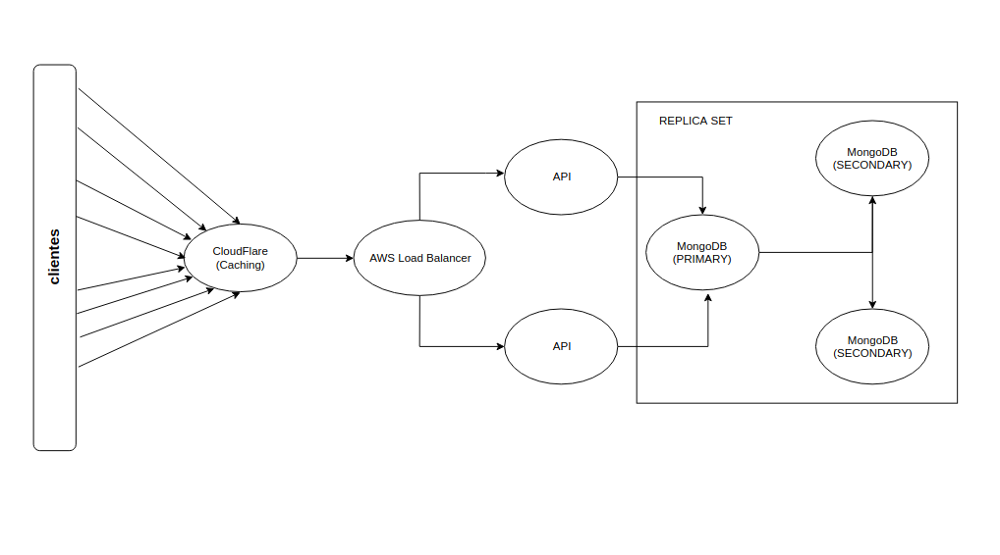

# api.sahdo.me

api.sahdo.me é uma api rest desenvolvida em PHP com o microframework Lumen 5.6.4. Ele é responsável por todo o backend do website sahdo.me.
Para testar a aplicação acesse [sahdo.me](http://sahdo.me) 

## Tech Stack utilizada neste projeto

- Servidor Linux Ubuntu 18.04 (Digital ocean)
- nginx
- Lumen 5.6.4
- php 7.2
- mongodb

## Instalando o php e bibliotecas necessárias

    sudo apt-get install php7.2 php7.2-soap php7.2-fpm php7.2-xml php7.2-bcmath php7.2-mbstring php7.2-mysql php7.2-curl php2-mongodb

Se tiver faltando alguma dependência, o composer irá apontar posteriormente, e então será necessário instalar a dependência manualmente.

## MongoDB

A conexão com o mongo pode ser local, mas já deixei o projeto apontando para meu servidor remoto, de forma que não se faz necessária a configuração local do mesmo. mas é opcional. Se quiser configurar no ambiente local será necessário criar o banco de dados "sahdo_me" e alterar as configurações no .env na raiz do projeto.

## Setup

Para simular o projeto em ambiente local você vai precisar configurar um servidor nginx ou apache. Não entrarei em muitos detahes, mas fornecerei o setup que utilizei com nginx.

O primeiro passo é baixar o projeto e executar o seguinte comando:

    composer update
        
Esse comando irá instalar todas a dependências do composer na pasta vendor do Lumen.

Feito isso você irá precisar criar um arquivo de configuração .env na raiz do projeto.
    
Crie o arquivo .env e cole a seguinte configuração:

    APP_ENV=local
    APP_DEBUG=true
    APP_KEY=
    APP_TIMEZONE=UTC
    
    LOG_CHANNEL=stack
    LOG_SLACK_WEBHOOK_URL=
    
    DB_CONNECTION=mongodb
    DB_HOST=mongodb://165.227.190.249:27777
    DB_PORT=3306
    DB_DATABASE=sahdo_me
    
Vamos precisar alterar algumas permissões, primeiramente digite:
    
    sudo chgrp -R www-data storage

Em seguida:

    sudo chmod -R ug+rwx storage
                  
Agora, conforme disse anteriormente mostrarei como configurei o virtualhost do meu servidor nginx:

    server {
        listen 80;
        listen [::]:80;
    
        root /var/www/api.sahdo.me/public;
    
        # Add index.php to the list if you are using PHP
        index index.html index.php index.htm index.nginx-debian.html;
    
        server_name api.sahdo.me;
    
        location / {
            try_files $uri $uri/ /index.php?$query_string;
        }
    
        # Execute PHP scripts
        location ~ \.php$ {
           fastcgi_pass unix:/var/run/php/php7.2-fpm.sock;
           fastcgi_split_path_info ^(.+\.php)(/.*)$;
           include fastcgi_params;
           fastcgi_param  SCRIPT_FILENAME    $document_root$fastcgi_script_name;
           fastcgi_param  HTTPS              off;
        }
    
        # deny access to .htaccess files, if Apache's document root
        # concurs with nginx's one
        location ~ /\.ht {
            deny all;
        }
    
        location ~* \.(eot|ttf|woff|woff2)$ {
           add_header Access-Control-Allow-Origin *;
        }
    }
    
## Banco de dados

Agora vamos alimentar a base de dados "sahdo_me" com os dados fakes dos seguintes place holders:

    1. https://jsonplaceholder.typicode.com/posts 
    2. https://jsonplaceholder.typicode.com/comments 
    3. https://jsonplaceholder.typicode.com/users 

Para isso basta digitar o seguinte comando na raiz do projeto:

    php artisan db:seed --class=FeedDatabaseSeeder 

## Infra

A infra em um cenário de muitas requests foi pensada para funcionar da seguinte maneira:

Primeiramente, para segurar a carga inicial temos o sistema de caching do cloud flare, este ficaria configurado para cachear todas as rotas com respostas repetitivas, economizando hits diretos nos servidores de api.

Os servidores de api por sua vez, ficam em load balancer, distribuindo a carga das requests que a eles chegam.

Na terceira etapa temos a camada de banco de dados em servidores isolados. Aqui podemos usar tanto o sistema de Replica Set do MongoDB como o sistema de Sharding. O Replica Set tem o propósito de manter servidores "clones" para garantir uma rápida ação de restauração de serviço em caso do servidor primário falhar.

O Sharding por sua vez visa distribuir a carga de consultas e updates em uma série de servidores, o que pensando a nível de performance é mais interessante.

O sistema dessa forma fica escalável, pois podemos tanto ter de 2 a N servidores de api em load balancer, como também de 2 a N servidores em Sharding. por experência própria posso dizer que os servidores do Mongo são os que mais se estressam nesse modelo de Infra, então ele vão ser os que mais vão utilizar recursos e eventualmente precisarão ser escalados.

O sistema de caching como o cloud flare ajuda de forma muito significativa nesse processo, gerando economia de bons valores de infra apenas cacheando rotas repetitivas.

## Deploy

Eu particulamente gosto de trabalhar com o bitbucket para deploy dos meus projetos. O bitbucket tem uma ferramente de deploy automático excelente. Então supondo que estamos utilizando a metodologia git flow para versionamento, ao mergear a branch de uma feature na master, automáticamente o commit vai para produção. Para eventuais rollbacks basta voltar ao commit anterior mais estável. 

